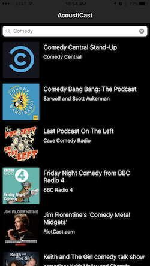

# acoustiCast
A podcast manager and player app for iOS.

### Description
acoustiCast is a podcast manager for iOS that offers users a unique experience when listening to podcasts.  Users can search and subscribe to any podcast, sync subscriptions, sync playback and sync episodes (all coming soon).

### User Stories
* As a user I want to be able to search for podcasts.
* As a I would like to be able to discover new podcasts.
* As a user I would like to have one convenient place where I can listen to all my podcasts.
* As a developer I want to provide a smooth, intuitive user experience.
* As a developer I want to provide a clean and concise UI.
* As a developer I want to let the user have access to his or her podcasts throughout his or her Apple devices.

### Screenshots
Search through podcasts | Select an episode | The player
:----------------------------:|:----------------------------: | :------:
 |    | 

### Instructions
To advance the track 15 seconds tap the forward button.  To back up 15 seconds tap the rewind button.  To get back to the list of episodes just swipe down the player screen to return.
### Authors
[Elyanil Castro](https://github.com/yanil3500)

[David Porter](https://github.com/thegrimheep)

[Pavel Parkhomey](https://github.com/pavelpark)
